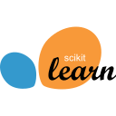
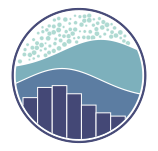

<h1 align="center">Hi 👋, I'm Nguyen Ngoc Lan</h1>
<h3 align="center">A passionate Data Scientist/AI Engineer with focus on Computer Vision</h3>

  

- 🔭 I’m currently working on [mini_pytorch_clone_cpp](https://github.com/lucvantien1211/mini_pytorch_clone_cpp)

- 🌱 I’m currently learning **Computer Vision, Reinforcement Learning, Unity, and maybe Robotics in near future**

- 👨‍💻 All of my projects are available at [https://github.com/lucvantien1211](https://github.com/lucvantien1211)

- ⚡ Fun fact **I am also interested in Game Development**

<h3 align="left">Connect with me:</h3>

<a href="https://github.com/lucvantien1211/"> GitHub</a>

<a href="https://huggingface.co/lucvantien1211"> HuggingFace</a>

<h3 align="left">Languages and Tools:</h3>
<h4 align="left">Languages</h4>

  
  
  

<h4 align="left">Machine Learning & AI</h4>

  
  
  
  
  
  

<h4 align="left">Tools & Platforms</h4>

  
  
  

<h4 align="left">Game Development</h4>

  

<h3 align="left">Notable Projects:</h3>
    

